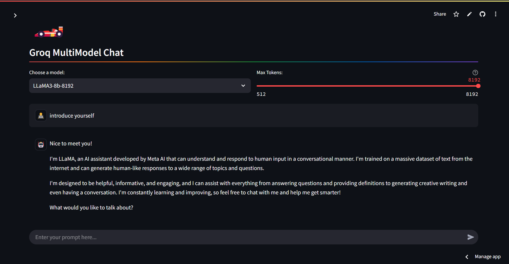

# GroqMultiChat [](https://groqmultichat.streamlit.app/)




GroqMultiChat is a [Streamlit](https://streamlit.io/) application that enables seamless interaction with multiple Large Language Models (LLMs) through the [Groq API](https://groq.com/). Users can select from various models to tailor their conversational experience. The app is publicly deployed and allows users to input their own API keys for personalized access.

## Features

- **Model Selection**: Choose from models such as `mixtral-8x7b-32768`, `llama-3.3-70b-versatile`, `Gemma2-9b-it`, `llama-3.1-8b-instant`, `llama3-70b-8192`, and `llama3-8b-8192` to customize your chat experience.
- **User API Key Input**: Enter your own Groq API key via the sidebar for personalized interactions.
- **Public Deployment**: Access the app directly through its public URL without any local setup.
- **Chat History**: Maintains a session-based chat history for a continuous conversation flow during your session.
- **Dynamic Response Generation**: Streams responses from the Groq API for a seamless chat experience.
- **Error Handling**: Gracefully manages potential errors during API calls to ensure a smooth user experience.

## Requirements

- Python 3.7+
- Streamlit
- Groq Python SDK

## Setup and Installation

1. **Clone the Repository**:

   ```bash
   git clone https://github.com/hardikjp7/GroqMultiChat.git
   cd GroqMultiChat
   ```

2. **Install Dependencies**:

   ```bash
   pip install -r requirements.txt
   ```

3. **Set Up Groq API Key**:

   You can input your Groq API key directly in the app's sidebar during runtime. Alternatively, for a persistent setup, store your API key using Streamlit's secrets management:

   ```toml
   # .streamlit/secrets.toml
   GROQ_API_KEY="your_api_key_here"
   ```

4. **Run the App**:

   ```bash
   streamlit run app.py
   ```

## Usage

- **Accessing the App**: The application is publicly deployed and can be accessed [here](https://groqmultichat.streamlit.app/).

- **Interacting with the Chatbot**:
  - Upon launching the app, select your preferred model from the dropdown menu.
  - Enter your Groq API key in the sidebar to authenticate your session.
  - Type your prompts in the chat input field to start the conversation.
  - The app will display your messages and the AI's responses, facilitating a back-and-forth dialogue.

## Customization

GroqMultiChat is designed for flexibility:

- **Adding New Models**: As Groq introduces more models, you can easily add them to the app's selection menu.
- **User Interface**: Modify the Streamlit components to enhance the user experience.
- **Extended Functionality**: Incorporate additional features or interactions with the Groq API as needed.

## Contributing

We welcome contributions to enhance GroqMultiChat:

- **Fork the Repository**: Create your own fork of the project.
- **Make Changes**: Implement your improvements or fixes.
- **Submit a Pull Request**: Share your contributions with the community.

For major changes, please open an issue first to discuss your ideas.

## License

This project is licensed under the Apache-2.0 License. See the [LICENSE](LICENSE) file for details.

---

Experience the speed and versatility of GroqMultiChat today! 🏎️💨 
